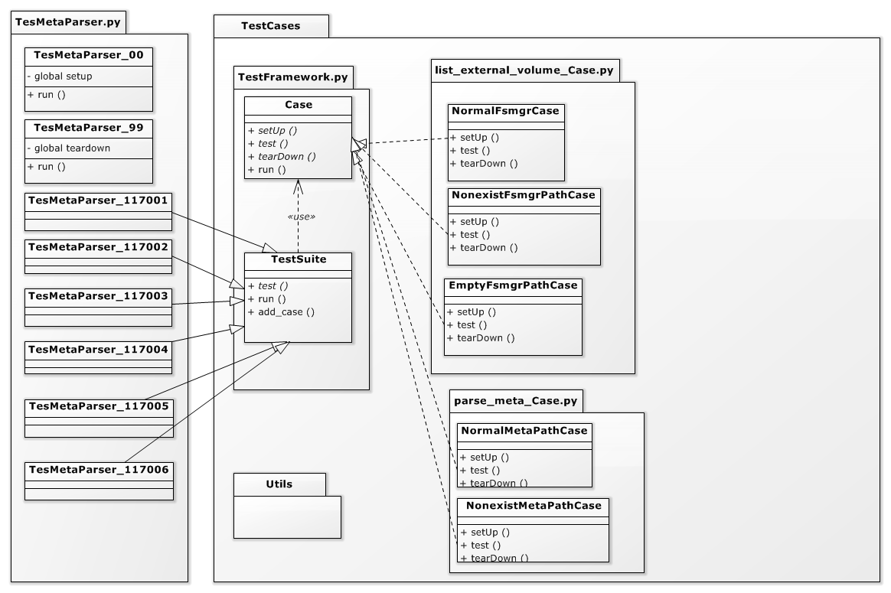

TestCases package
- 將 test case 放在這個 package 內,test case 須名稱為 XXXCase.py.
- XXXCase.py 內可含數個 case ,,該類別須繼承 Case.py 內的 Case class
- Global setUp and tearDown 請實作於上一層 pi_tester.py 呼叫的 py 中的 00 and 99
- 須於上一層 pi_tester.py 呼叫的 py 中於對應測試編號的類別繼承 TestCases.TestFramework.TestSuite 並 add test case 如下

- """""""""""""""""""""""""""""""""""""""""""""""""""""""""""""
- 	from TestCases import FilePropertyCase

- 	class TestSdcardCaseSensitive_03(TestSuite):

- 		def test(self):
- 		    self.add_case(FilePropertyCase.FeatureAliasInodeNumReleaseCase())
- """""""""""""""""""""""""""""""""""""""""""""""""""""""""""""

Test example architecture
 
